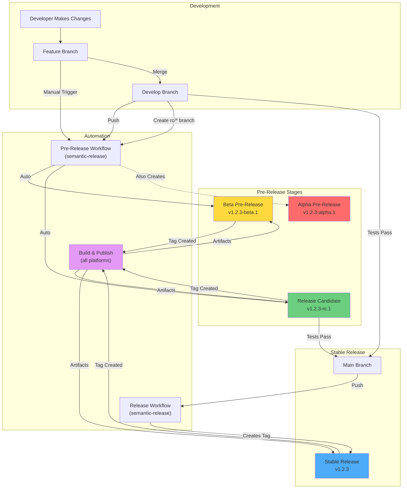

# Release & Pre-Release Workflows

## Visual Workflow



## Quick Navigation

| Document | Description | Audience |
|----------|-------------|----------|
| [📖 Pre-Release Guide](./PRE_RELEASE_GUIDE.md) | Complete pre-release documentation | Everyone |
| [⚡ Quick Reference](./PRE_RELEASE_QUICK_REF.md) | Common commands and workflows | Developers |
| [📋 Release Workflow](./RELEASE_WORKFLOW.md) | Stable release process | Maintainers |

## Release Types

| Type | Version Format | Stability | Use Case |
|------|----------------|-----------|----------|
| **Alpha** | `1.2.3-alpha.1` | Unstable | Early feature testing |
| **Beta** | `1.2.3-beta.1` | Mostly Stable | Feature-complete testing |
| **RC** | `1.2.3-rc.1` | Stable | Final pre-production testing |
| **Stable** | `1.2.3` | Production | Public release |

## Typical Release Cycle

```
Week 1-2: Feature Development
  ├── feature/new-dashboard → v1.2.0-alpha.1
  ├── feature/api-update   → v1.2.0-alpha.2
  └── Merge to develop

Week 3: Integration & Beta Testing
  ├── develop → v1.2.0-beta.1
  ├── fix bugs → v1.2.0-beta.2
  └── final fixes → v1.2.0-beta.3

Week 4: Release Candidate
  ├── rc/1.2.0 → v1.2.0-rc.1
  ├── critical fix → v1.2.0-rc.2
  └── Tests Pass ✓

Week 5: Stable Release
  └── merge to main → v1.2.0
```

## For Developers

### Create Beta Pre-Release
```bash
git checkout develop
git commit -m "feat: add new feature"
git push origin develop
# Result: v1.2.3-beta.1
```

### Create Release Candidate
```bash
git checkout -b rc/1.2.0
git push origin rc/1.2.0
# Result: v1.2.0-rc.1
```

### Promote to Stable
```bash
git checkout main
git merge rc/1.2.0
git push origin main
# Result: v1.2.0
```

## For Maintainers

### Manual Pre-Release
1. Actions → Pre-Release workflow
2. Run workflow → Select type & branch
3. Wait for artifacts to build

### Emergency Hotfix
```bash
git checkout main
git checkout -b hotfix/1.2.1
git commit -m "fix: critical security issue"
git push origin hotfix/1.2.1
# Create PR to main
```

## Workflows

| Workflow | Trigger | Creates | Artifacts |
|----------|---------|---------|-----------|
| [pre-release.yml](../workflows/pre-release.yml) | develop, rc/* push | Pre-releases | Via ci-cd.yml |
| [release.yml](../workflows/release.yml) | main push | Stable releases | Via ci-cd.yml |
| [ci-cd.yml](../workflows/ci-cd.yml) | Tags v* | - | All platforms |

## Support

- 📚 Read the guides linked above
- 🐛 Report issues with `release-process` label  
- 💬 Discuss in team chat

---

**Last Updated**: October 6, 2025
