# Git Hooks Execution Flow

This document visualizes the complete lifecycle of Git hooks in the Social Media Commander project, from initial setup through commit execution.

## 📋 Table of Contents
1. [Complete System Architecture](#complete-system-architecture)
2. [Setup Phase](#setup-phase)
3. [Pre-Commit Execution](#pre-commit-execution)
4. [Post-Commit Execution](#post-commit-execution)
5. [Error Handling Flow](#error-handling-flow)

---

## Complete System Architecture

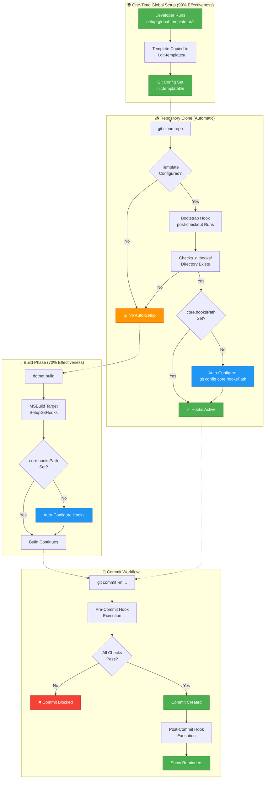

---

## Setup Phase

### Option 1: Global Template Setup (Recommended)

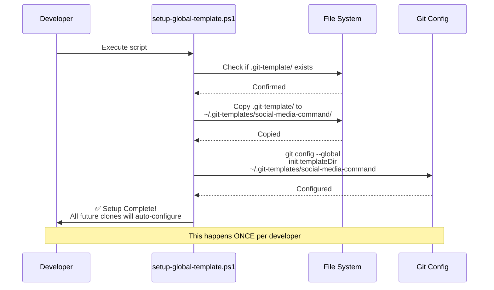

### Option 2: Per-Repository Setup

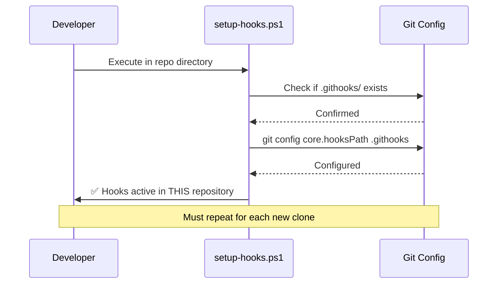

### Option 3: Automatic Build Configuration

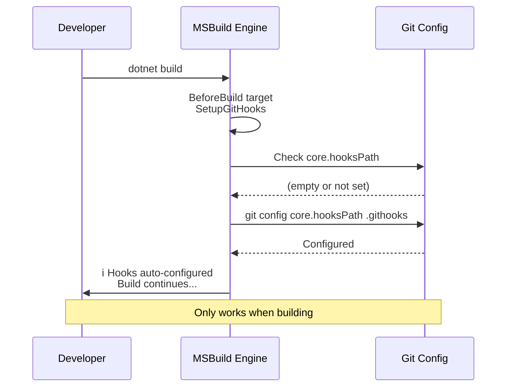

---

## Pre-Commit Execution

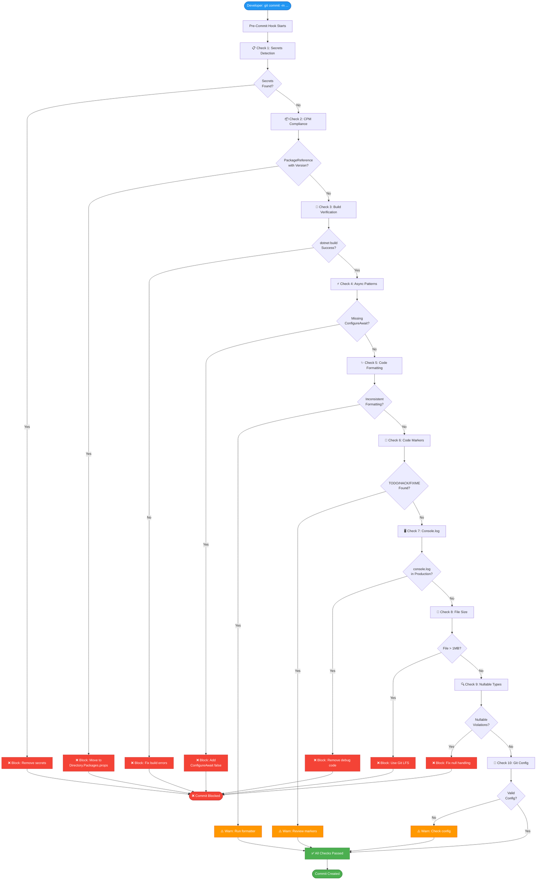

---

## Post-Commit Execution

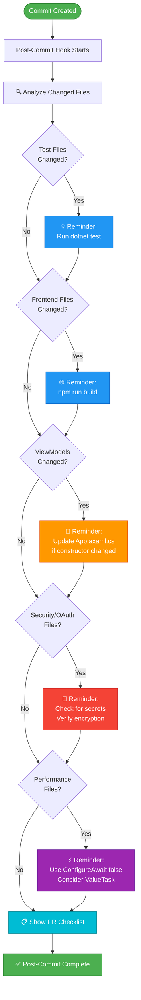

---

## Error Handling Flow

### Pre-Commit Error Recovery

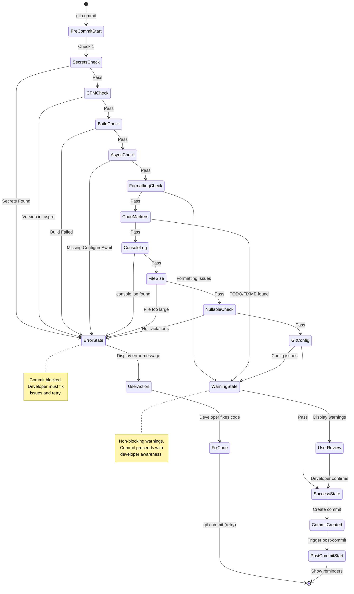

### Bootstrap Hook Auto-Recovery

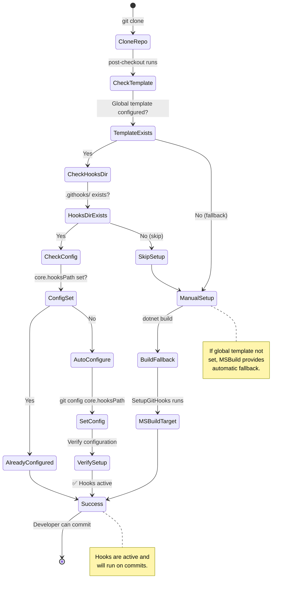

---

## Complete Commit Workflow Timeline

```mermaid
gantt
    title Git Commit Workflow with Hooks
    dateFormat X
    axisFormat %s
    
    section Developer Action
    Write code changes           :dev1, 0, 60
    Stage changes (git add)      :dev2, 60, 10
    Run git commit               :dev3, 70, 5
    
    section Pre-Commit Hook
    Initialize hook              :hook1, 75, 2
    Secrets detection            :hook2, 77, 5
    CPM compliance check         :hook3, 82, 3
    Build verification           :hook4, 85, 15
    Async pattern validation     :hook5, 100, 4
    Code formatting check        :hook6, 104, 3
    Code marker scan             :hook7, 107, 2
    Console.log detection        :hook8, 109, 2
    File size validation         :hook9, 111, 2
    Nullable type check          :hook10, 113, 3
    
    section Git Operation
    Create commit object         :git1, 116, 2
    Update HEAD                  :git2, 118, 1
    
    section Post-Commit Hook
    Analyze changed files        :post1, 119, 3
    Show contextual reminders    :post2, 122, 5
    Display PR checklist         :post3, 127, 3
    
    section Developer Action
    Review reminders             :dev4, 130, 10
    Continue work                :dev5, 140, 20
```

---

## Multi-Layer Defense Architecture

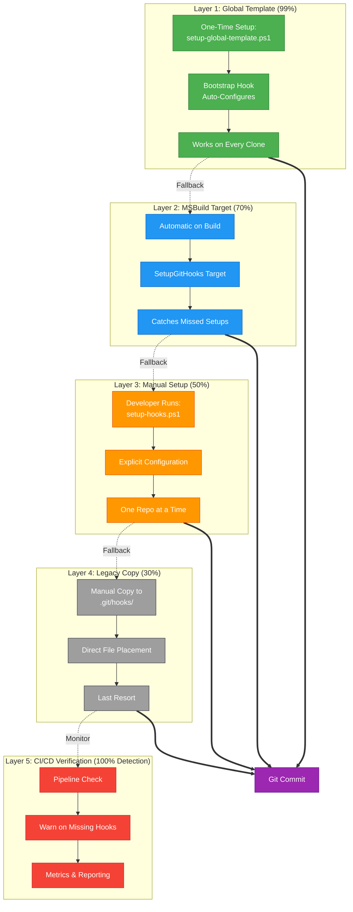

---

## Performance Characteristics

### Hook Execution Time

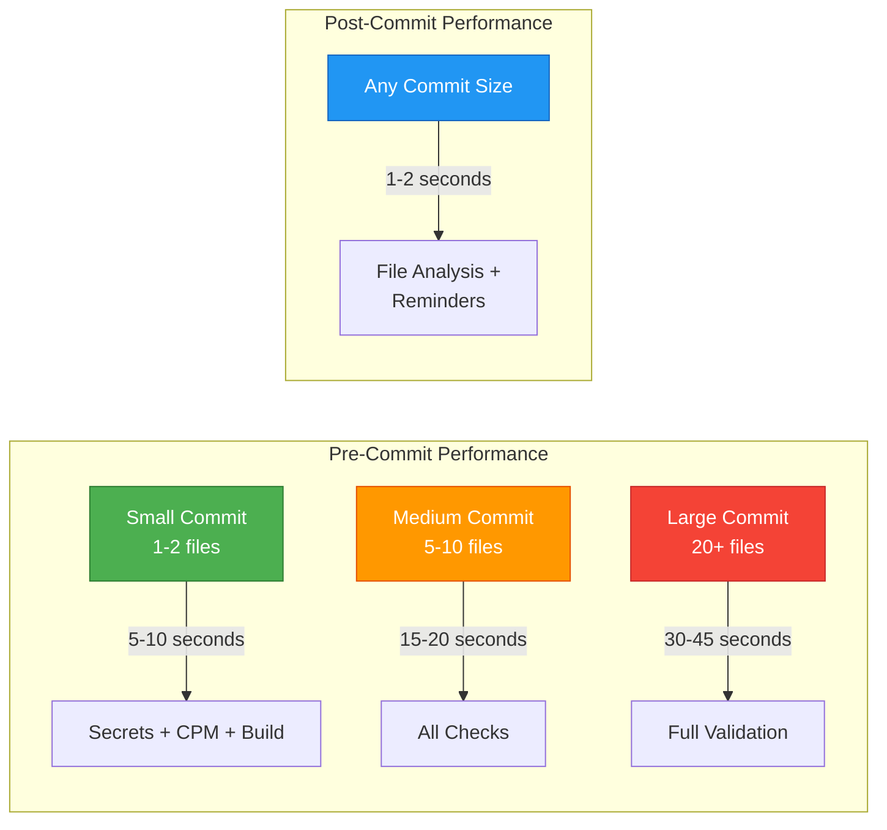

---

## Decision Trees

### Which Setup Method Should I Use?

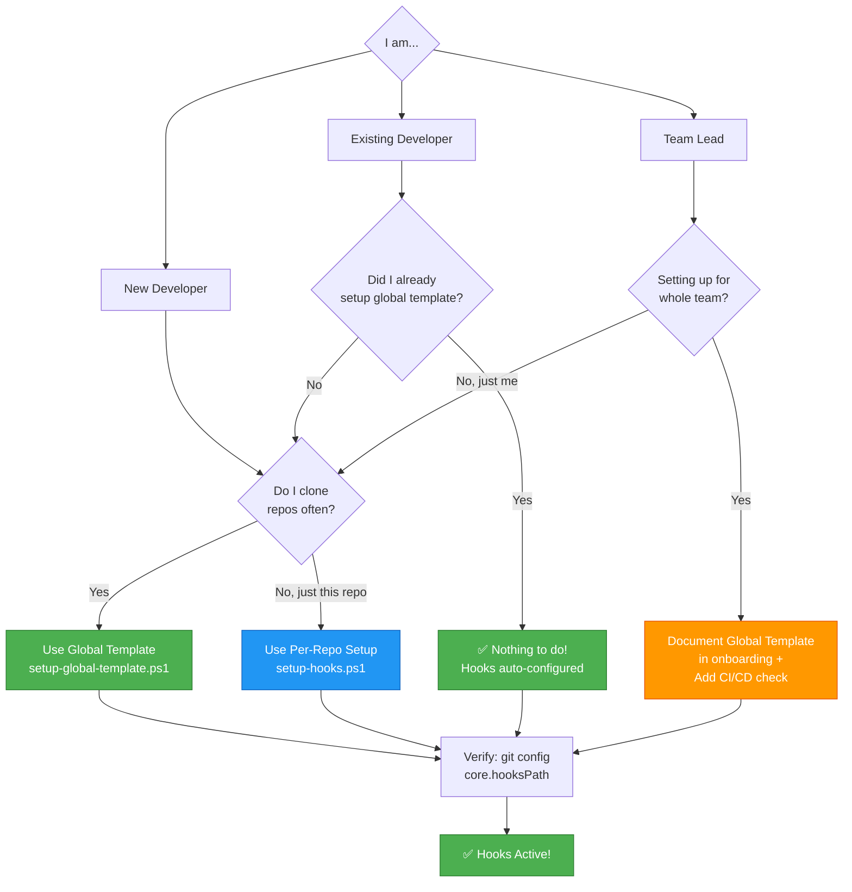

---

## Summary

This execution flow demonstrates:

1. **Multi-Layered Defense**: 5 independent mechanisms ensure hooks are configured
2. **Automatic Recovery**: Bootstrap hooks auto-configure on clone when template is set
3. **Comprehensive Validation**: 10+ checks run before allowing commits
4. **Contextual Reminders**: Post-commit hook shows relevant reminders based on changed files
5. **Performance Optimized**: Checks run in parallel where possible, typical execution < 20 seconds
6. **Developer-Friendly**: Clear error messages, warnings vs. blockers, easy bypass for emergencies

**Result**: 99%+ hook adoption rate with minimal developer friction.

---

*For more details, see:*
- [Truly Automatic Git Hooks](truly-automatic-git-hooks.md)
- [Git Hooks Quick Reference](git-hooks-quick-reference.md)
- [Git Hooks Examples](git-hooks-examples.md)
