```mermaid
flowchart TD
    Start([Developer runs: git commit]) --> PreCommit[Pre-commit Hook Triggers]
    
    PreCommit --> Check1{Secrets Check}
    Check1 -->|Secrets Found| Block1[❌ Block Commit]
    Check1 -->|No Secrets| Check2{CPM Compliance}
    
    Check2 -->|Violations| Block2[❌ Block Commit]
    Check2 -->|Compliant| Check3{Build Check}
    
    Check3 -->|Build Fails| Block3[❌ Block Commit]
    Check3 -->|Build Passes| Check4{Async Patterns}
    
    Check4 -->|Issues Found| Warn1[⚠️ Warning: Continue]
    Check4 -->|Looks Good| Check5{Code Format}
    Warn1 --> Check5
    
    Check5 -->|Format Issues| Warn2[⚠️ Warning: Continue]
    Check5 -->|Formatted| Check6{Code Markers}
    Warn2 --> Check6
    
    Check6 -->|Found TODO/FIXME| Warn3[⚠️ Warning: Continue]
    Check6 -->|None Found| Check7{File Size}
    Warn3 --> Check7
    
    Check7 -->|Large Files| Warn4[⚠️ Warning: Continue]
    Check7 -->|Normal| AllPassed[✅ All Checks Passed]
    Warn4 --> AllPassed
    
    AllPassed --> CommitCreated[📝 Commit Created]
    
    Block1 --> ShowError1[Show Error Message]
    Block2 --> ShowError2[Show Error Message]
    Block3 --> ShowError3[Show Error Message]
    
    ShowError1 --> Exit1([❌ Exit: No Commit])
    ShowError2 --> Exit1
    ShowError3 --> Exit1
    
    CommitCreated --> PostCommit[Post-commit Hook Triggers]
    
    PostCommit --> Analyze[Analyze Changed Files]
    
    Analyze --> Remind1{C# Files Changed?}
    Remind1 -->|Yes| ShowTest[💡 Suggest: Run Tests]
    Remind1 -->|No| Remind2{Frontend Changed?}
    ShowTest --> Remind2
    
    Remind2 -->|Yes| ShowDev[💡 Suggest: npm run dev]
    Remind2 -->|No| Remind3{ViewModels Changed?}
    ShowDev --> Remind3
    
    Remind3 -->|Yes| ShowVM[⚠️ Remind: Update App.axaml.cs]
    Remind3 -->|No| Remind4{Security Files?}
    ShowVM --> Remind4
    
    Remind4 -->|Yes| ShowSec[⚠️ Remind: Update Docs]
    Remind4 -->|No| Remind5{Feature Branch?}
    ShowSec --> Remind5
    
    Remind5 -->|Yes| ShowPR[📋 Show PR Checklist]
    Remind5 -->|No| Stats[📊 Show Commit Stats]
    ShowPR --> Stats
    
    Stats --> Complete([✅ Complete])
    
    style Start fill:#e1f5ff
    style Complete fill:#d4edda
    style Exit1 fill:#f8d7da
    style Block1 fill:#f8d7da
    style Block2 fill:#f8d7da
    style Block3 fill:#f8d7da
    style AllPassed fill:#d4edda
    style CommitCreated fill:#d4edda
    style Warn1 fill:#fff3cd
    style Warn2 fill:#fff3cd
    style Warn3 fill:#fff3cd
    style Warn4 fill:#fff3cd
```

## Hook Workflow Explanation

### Pre-commit Phase (Quality Gates)

1. **Secrets Detection** 🔐
   - Scans for hardcoded credentials
   - Checks API keys, passwords, tokens
   - **BLOCKS** if found

2. **Central Package Management** 📦
   - Validates no versions in .csproj files
   - All versions must be in Directory.Packages.props
   - **BLOCKS** if violations found

3. **Build Verification** 🏗️
   - Runs `dotnet build SocialMediaCommander.sln`
   - **BLOCKS** if build fails

4. **Async Patterns** ⚡
   - Checks for ConfigureAwait(false) in library code
   - **WARNS** if missing (doesn't block)

5. **Code Formatting** 🎨
   - Runs `dotnet format --verify-no-changes`
   - **WARNS** if issues found

6. **Code Markers** 📝
   - Detects TODO/FIXME/HACK
   - **WARNS** for tracking

7. **File Size** 📏
   - Checks for files >1MB
   - **WARNS** if found

### Post-commit Phase (Helpful Reminders)

1. **Test Suggestions** 🧪
   - Reminds to run tests if C# changed

2. **Frontend Dev** 🎨
   - Suggests dev server if UI changed

3. **ViewModel Updates** 🔧
   - Reminds to update DI composition

4. **Security Documentation** 🔐
   - Reminds to update docs if security files changed

5. **PR Checklist** 📋
   - Shows complete checklist on feature branches

6. **Statistics** 📊
   - Displays commit stats (files, lines changed)

## Error vs Warning Strategy

### Errors (Block Commit) ❌
- Security risks (secrets)
- Build-breaking changes
- Architectural violations (CPM)

### Warnings (Allow Commit) ⚠️
- Best practice deviations
- Code quality suggestions
- Potential issues to review

This balance prevents frustration while maintaining quality standards.
